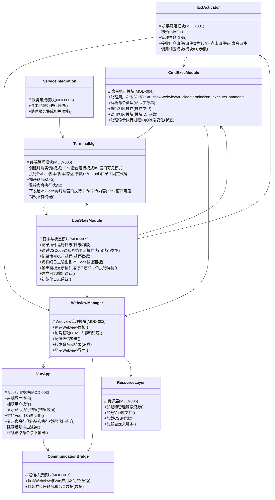

# VSCode 插件设计方案

## 1. 架构设计

### 1.1 整体架构

AI_Plugin作为VSCode插件提供一个基于Vue 2的交互式Webview界面，用户可以在其中输入命令并查看结果。插件作为中间层，连接前端Webview和本地服务，支持多种格式信息展示。整体架构遵循VSCode插件开发最佳实践，同时结合Vue 2框架提供丰富的前端交互体验。

### 1.2 模块划分

根据需求文档，AI_Plugin划分为以下核心模块，每个模块负责特定的功能领域：

- **扩展激活模块 (MOD-001)**：负责插件的初始化、生命周期管理，接收用户事件（点击、命令），并调用相应模块处理
- **Webview管理模块 (MOD-002)**：负责创建和管理Webview面板，加载基础HTML内容和资源，配置通信渠道，转发命令和结果，显示Webview界面
- **Vue应用模块 (MOD-003)**：负责前端界面的渲染和交互，捕获用户操作，显示命令执行结果，支持Vue-i18n国际化，处理命令行代码块显示与执行，管理输出内容的动态渲染与阻塞控制
- **命令执行模块 (MOD-004)**：负责处理用户命令，解析命令类型，执行相应操作（如showWebview、clearTerminals），调用相应模块，处理命令执行过程中的状态变化
- **终端管理模块 (MOD-005)**：负责创建和管理终端实例，支持后台运行模式和窗口可见模式，执行Python脚本，捕获命令输出，监控命令执行状态，销毁终端实例
- **资源层 (MOD-006)**：负责加载和管理静态资源，包括Vue库文件、CSS样式和自定义脚本
- **通信桥接模块 (MOD-007)**：负责Webview与Vue应用之间的通信，封装并传递命令和结果数据
- **服务集成模块 (MOD-008)**：负责与本地服务的通信，处理服务集成相关功能
- **日志与状态模块 (MOD-009)**：负责记录插件运行日志，通过VSCode通知系统显示操作状态，记录命令执行过程，将详细日志输出到VSCode输出面板

### 1.3 模块类图

### 1.3 分离式设计

#### 1.3.1 前端与后端分离
- **前端**：Webview中运行的Vue 2应用
- **后端**：VSCode插件的TypeScript代码
- **通信方式**：使用VSCode的消息通信机制进行双向通信

#### 1.3.2 Webview与Vue应用分离
- **Webview容器**：由VSCode提供的Webview面板
- **Vue应用**：在Webview中运行的Vue 2应用
- **通信桥接**：通过消息机制实现Webview与Vue应用的通信

- **资源文件**：静态资源（HTML、CSS、JS等）与插件代码分离，存放在static/目录中
 

#### 1.3.3 Webview与HTML分离
- **Webview控制器**：VSCode插件中负责管理Webview生命周期的控制器
- **HTML内容生成器**：负责生成Webview加载的HTML内容
- **前端脚本**：负责处理用户交互和与插件通信

### 1.4 Vue 2集成方案

#### 1.4.1 Vue框架集成
- Webview前端基于Vue 2框架实现，提供响应式UI界面
- 集成Vue-i18n实现国际化支持
- 采用简单直接的JS文件引用方式，无需复杂构建工具
- 实现简洁的单向数据流，确保界面响应迅速

#### 1.4.2 Vue应用结构
具体实现请参考：static/js/app.js

### 1.5 Webview管理模块设计

WebviewManager负责管理Webview的创建、销毁、通信和单例模式，确保Webview资源的高效使用。

### 2. 国际化方案

### 2.1 插件层面国际化
- 使用VSCode的l10n API实现插件界面元素的国际化
- 支持多语言配置文件（.json格式）
- 根据VSCode界面语言自动切换插件界面语言

### 2.2 Vue-i18n集成
- 在Webview中集成Vue-i18n库实现前端界面的国际化
- 支持Webview内手动切换语言功能
- 提供默认语言和回退机制

### 3. 测试框架设计

### 3.1 测试分层
采用多层测试架构，确保不同层级都可以进行自动化测试：
- **单元测试**：测试单个组件或函数的功能
- **集成测试**：测试模块间的交互和协作
- **端到端测试**：测试完整的用户流程

### 3.2 不同层级测试框架选型

#### 3.2.1 单元测试
- **框架**：Jest (JavaScript/TypeScript)
- **目的**：测试独立函数和组件的功能
- **适用范围**：插件核心逻辑、工具函数
- **自动化支持**：支持CI/CD环境自动执行

具体实现请参考：jest.config.js

#### 3.2.2 集成测试
- **框架**：Jest + VSCode Test API
- **目的**：测试模块间的交互和协作，确保多个组件协同工作正常
- **适用范围**：组件间通信测试、服务调用链测试、API集成测试、VSCode插件功能集成测试
- **自动化支持**：支持CI/CD环境自动执行

#### 3.2.3 端到端测试
- **框架**：Jest + VSCode Test API
- **目的**：测试完整的用户流程，模拟真实用户操作场景
- **适用范围**：用户交互流程测试、完整功能链路测试、错误场景处理测试
- **自动化支持**：支持CI/CD环境自动执行

具体实现请参考：test/e2e/extensionEndToEnd.test.ts

### 3.3 测试目录结构
具体目录结构请参考：test/ 目录

### 3.4 自动执行机制
- 使用GitHub Actions或其他CI/CD工具配置自动化测试
- 支持本地和远程环境的测试执行
- 测试结果报告生成

具体实现请参考：.github/workflows/test.yml

## 4. 实现细节

### 4.1 调试信息展示
- 使用VSCode的`console.log`、`console.warn`、`console.error`等方法记录调试信息
- 创建统一的日志工具函数，包含时间戳、操作类型、数据内容等信息
- 日志级别可配置（debug、info、warn、error）

具体实现请参考：src/utils/logger.ts

### 4.2 Webview创建与通信
- 使用VSCode的`createWebviewPanel`方法创建Webview
- 实现Webview单例模式，确保同一时间只能打开一个Webview实例
- 实现双向通信机制（VSCode → Webview 和 Webview → VSCode）
- 使用消息通道进行安全通信

具体实现请参考：src/utils/webviewManager.ts
### 4.3 终端命令执行

终端命令执行模块是插件的核心功能之一，支持两种执行模式：
1. **主执行模式**：调用tools/interactive-tool.py执行命令
2. **界面输出模式**：命令行代码由tools/execinfo.py处理

两种模式均使用相同的JSON格式进行输入输出，确保数据交换的一致性和可扩展性。

具体实现请参考：src/utils/terminalManager.ts
### 4.1 前端资源加载方式

- 使用VSCode的Webview资源加载API直接加载JavaScript文件
- 采用直接使用JS方式，无需编译构建即可执行
- 支持加载Vue2库和自定义脚本
- 实现资源缓存策略，提高性能

### 4.2 Vue 2 集成方案

- Webview前端基于Vue 2框架实现
- 集成Vue-i18n实现国际化支持
- 采用简单直接的JS文件引用方式，不使用复杂的构建工具
- 实现简洁的单向数据流，确保界面响应迅速

### 4.3 终端命令执行
- 使用VSCode的`window.createTerminal`方法创建终端窗口
- 通过终端的`sendText`方法发送命令到终端执行
- 监听终端的`onDidWriteData`事件捕获执行结果
- 实现终端管理，包括创建、复用和销毁

具体实现请参考：static/js/app.js
## 5. 扩展性设计
- 插件配置项设计，支持用户自定义设置
- 命令行服务接口标准化，支持不同后端服务接入
- Webview组件化设计，便于功能扩展