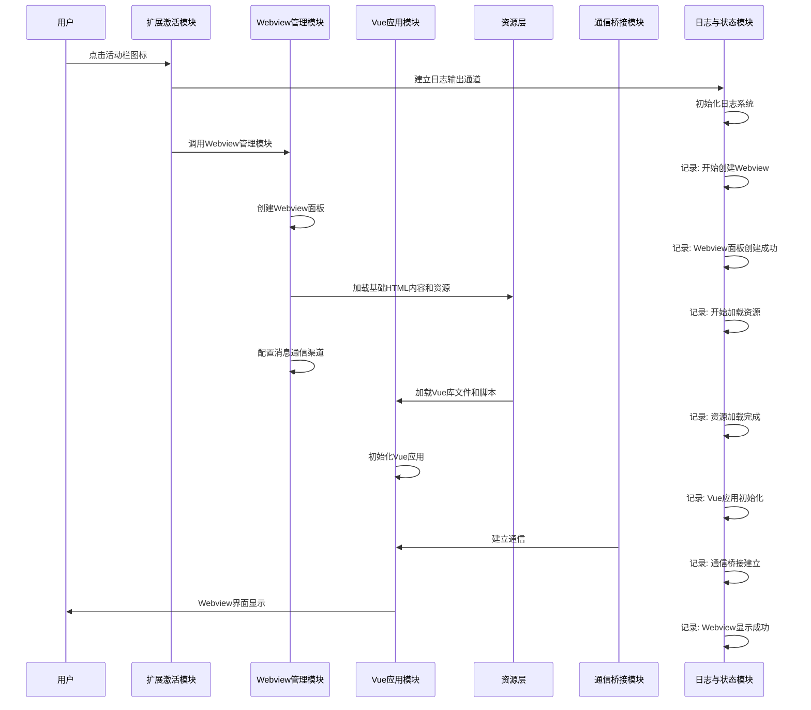
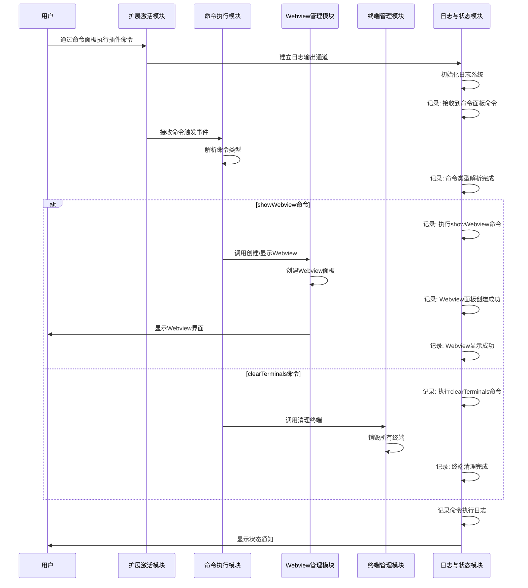
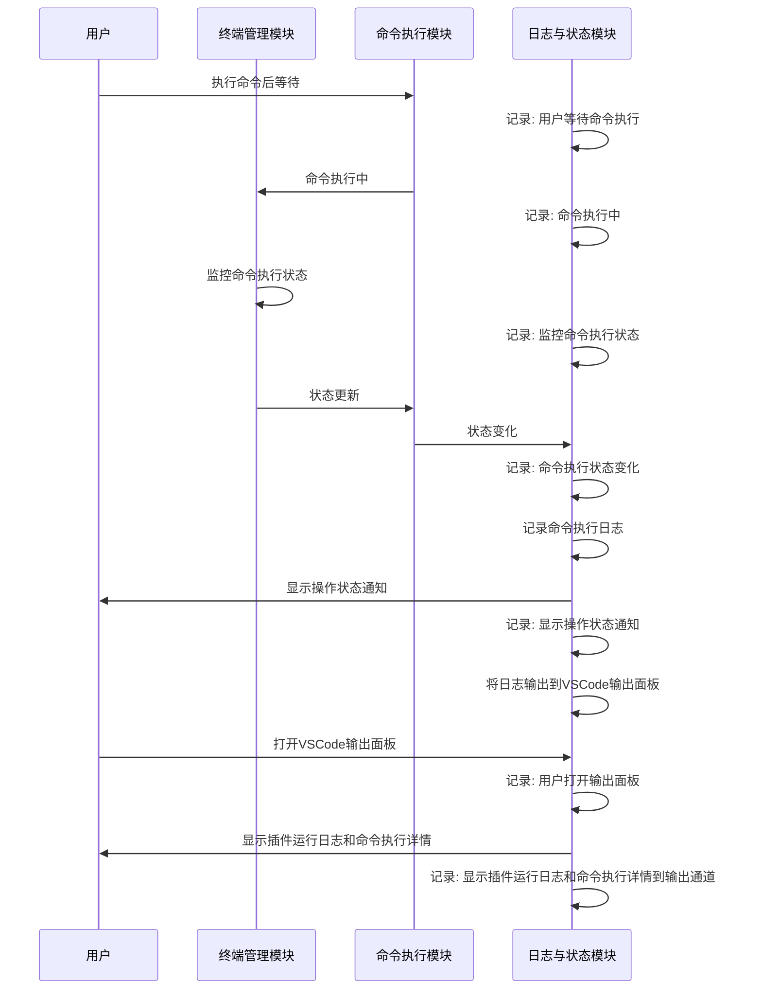

# AI_Plugin 需求文档

## 1. 项目概述

AI_Plugin 是一个基于Vue 2的交互式工具视图，作为VSCode插件提供丰富的用户交互界面和功能。插件作为中间层，连接前端Webview和本地服务，支持两种执行模式：主执行模式（调用tools/interactive-tool.py）和界面输出模式（命令行代码由tools/execinfo.py处理），两种模式均使用相同的JSON格式进行输入输出。

### 1.1 用户操作场景列表
- 活动栏图标点击：用户点击VSCode活动栏中的插件图标打开Webview界面
- 命令面板调用：用户通过VSCode命令面板直接执行插件功能
- 多轮次交互：用户在Webview界面中进行多轮次的命令输入和结果查看
- 命令行代码执行：用户在Webview中查看命令行代码并点击执行按钮
- 执行状态监控：用户查看命令执行的状态反馈（运行中、成功、失败等）
- 调试信息查看：用户通过VSCode输出面板查看插件日志

### 1.2 插件模块列表
- **扩展激活模块**：负责插件的初始化和生命周期管理
- **Webview管理模块**：负责创建和管理Webview面板，实现与前端Vue应用的通信
- **Vue应用模块**：负责前端界面的渲染和交互，支持Vue-i18n国际化
- **命令执行模块**：负责处理用户命令和执行相关操作
- **终端管理模块**：负责创建和管理终端实例
- **资源层**：负责加载和管理静态资源，包括Vue库文件和自定义脚本
- **通信桥接模块**：负责Webview与Vue应用之间的通信
- **服务集成模块**：负责与本地服务的集成
- **日志与状态模块**：负责记录插件运行日志和显示状态信息

## 2. 场景分析

### 2.1 场景一：活动栏图标点击打开Webview

#### 2.1.1 功能时序图
1. **用户操作**：用户点击VSCode活动栏中的插件图标
2. **扩展激活模块**：接收点击事件，建立日志输出通道
3. **日志与状态模块**：初始化日志系统，记录关键操作
4. **扩展激活模块**：调用Webview管理模块
5. **Webview管理模块**：创建Webview面板，加载基础HTML内容，配置消息通信渠道
6. **日志与状态模块**：记录Webview创建和资源加载过程
7. **资源层**：加载Vue库文件、CSS样式和自定义脚本
8. **Vue应用模块**：在Webview中初始化Vue应用
9. **通信桥接模块**：建立Webview与Vue应用之间的通信
10. **日志与状态模块**：记录应用初始化和通信建立过程
11. **用户交互**：Webview界面显示，用户可以开始交互，日志记录完成信息



### 2.2 场景二：命令面板调用插件功能

#### 2.2.1 功能时序图
1. **用户操作**：用户通过VSCode命令面板输入并执行插件命令（如showWebview、clearTerminals）
2. **扩展激活模块**：接收命令触发事件，建立日志输出通道
3. **日志与状态模块**：初始化日志系统，记录接收到命令面板命令
4. **扩展激活模块**：转发命令到命令执行模块
5. **命令执行模块**：解析命令类型
6. **日志与状态模块**：记录命令类型解析完成
7. **命令执行模块**：根据命令类型执行相应操作
   - 若为showWebview命令：
     - 日志记录执行showWebview命令
     - 调用Webview管理模块创建或显示Webview
     - Webview管理模块创建Webview面板
     - 日志记录Webview面板创建成功和显示成功
   - 若为clearTerminals命令：
     - 日志记录执行clearTerminals命令
     - 调用终端管理模块清理所有终端
     - 终端管理模块销毁所有终端
     - 日志记录终端清理完成
8. **日志与状态模块**：记录命令执行完成日志，显示状态通知



### 2.3 场景三：Webview中执行命令并查看结果

#### 2.3.1 功能时序图
1. **用户操作**：用户在Webview界面中输入命令或点击执行按钮
2. **Vue应用模块**：捕获用户操作，记录日志，通过通信桥接模块发送命令到Webview
3. **Webview管理模块**：接收来自Webview的命令消息，记录日志，转发给命令执行模块
4. **命令执行模块**：记录日志，处理命令请求，执行主命令，记录主命令开始执行
5. **终端管理模块**：记录日志，创建终端实例（后台运行模式），执行主命令（tools目录下的固定的pyhton代码），捕获主命令输出
6. **终端管理模块**：将主命令的部分输出返回给Webview管理模块，支持多次输出
7. **Webview管理模块**：接收输出，记录日志，转发给Vue应用模块
8. **Vue应用模块**：接收输出，更新界面显示在输出块，记录界面更新
9. **检查输出**：如果输出携带"命令行代码时刻"标记
   9.1 **Vue应用模块**：显示命令行代码块和执行按钮，阻塞后续输出渲染
   9.2 **用户操作**：用户点击命令行代码块后面的执行按钮
   9.3 **Vue应用模块**：捕获点击事件，记录日志，通过通信桥接模块发送命令行代码（此为第三命令模式（通用命令模式），内容来自第一命令或者第二命令的输出）
   9.4 **Webview管理模块**：接收命令行代码，记录日志，转发给终端管理模块
   9.5 **终端管理模块**：记录日志，下发给vscode的终端窗口执行第三通用命令（和上面后台执行不同，这个直接在窗口可见），并捕获终端窗口命令的输出
   9.5.1 输出信息提交给后台方式执行命令行代码（第二命令，是固定的tools目录下的另外一个pyhton代码），捕获后台方式第二命令的输出
   9.6 **终端管理模块**：将第二命令执行结果返回给Webview管理模块（输出也支持多条）
   9.7 **Webview管理模块**：接收结果，记录日志，转发给Vue应用模块
   9.8 **Vue应用模块**：接收结果，更新界面显示第二命令输出
   9.9 **检查结束标志**：当收到第二命令的结束符号后，继续渲染主命令的余下输出
   9.10 **Vue应用模块**：如果第二命令的输出某一条携带“命令行代码时刻”标记，则第二余下的阻塞，并转到9步骤继续递归处理
   
10. **检查主命令结束标志**：当收到主命令的结束标志，才算本次主命令执行完毕
11. **日志与状态模块**：记录整个命令执行过程到输出通道

```mermaid
sequenceDiagram
    participant User as 用户
    participant VueApp as Vue应用模块
    participant WebviewMgr as Webview管理模块
    participant CmdExecModule as 命令执行模块
    participant TerminalMgr as 终端管理模块
    participant LogStateModule as 日志与状态模块
    
    User->>VueApp: 在Webview中输入命令/点击执行
    VueApp->>LogStateModule: 记录: 用户发起命令执行请求
    VueApp->>WebviewMgr: 通过通信桥接模块发送命令
    WebviewMgr->>LogStateModule: 记录: 接收到Webview命令
    WebviewMgr->>CmdExecModule: 转发命令消息
    CmdExecModule->>LogStateModule: 记录: 开始处理命令请求
    CmdExecModule->>TerminalMgr: 执行主命令
    LogStateModule->>LogStateModule: 记录: 主命令开始执行
    TerminalMgr->>TerminalMgr: 创建终端实例（后台运行模式）
    LogStateModule->>LogStateModule: 记录: 后台终端实例创建成功
    TerminalMgr->>TerminalMgr: 执行主命令（tools目录下的固定Python代码）
    LogStateModule->>LogStateModule: 记录: 主命令执行中
    
    loop 主命令多次输出
        TerminalMgr->>WebviewMgr: 返回主命令部分输出
        LogStateModule->>LogStateModule: 记录: 主命令部分输出返回
        WebviewMgr->>VueApp: 转发输出
        LogStateModule->>LogStateModule: 记录: 输出转发到Webview
        VueApp->>VueApp: 更新界面输出块显示
        LogStateModule->>LogStateModule: 记录: 界面更新
        
        alt 输出携带"命令行代码时刻"标记
            VueApp->>VueApp: 显示命令行代码块和执行按钮
            LogStateModule->>LogStateModule: 记录: 显示命令行代码块
            VueApp->>VueApp: 阻塞后续输出渲染
            
            User->>VueApp: 点击命令行代码块后面的执行按钮
            VueApp->>LogStateModule: 记录: 用户点击执行按钮
            VueApp->>WebviewMgr: 通过通信桥接模块发送命令行代码（第三命令模式）
            LogStateModule->>LogStateModule: 记录: 发送第三命令（通用命令模式）
            WebviewMgr->>LogStateModule: 记录: 接收到命令行代码
            WebviewMgr->>TerminalMgr: 转发命令行代码
            TerminalMgr->>LogStateModule: 记录: 准备执行第三通用命令
            TerminalMgr->>TerminalMgr: 下发给VSCode的终端窗口执行第三通用命令（窗口可见）
            LogStateModule->>LogStateModule: 记录: 第三通用命令执行中
            
            TerminalMgr->>TerminalMgr: 输出信息提交给后台方式执行命令行代码（第二命令）
            LogStateModule->>LogStateModule: 记录: 开始后台执行第二命令（tools目录下的另一个Python代码）
            
            loop 第二命令多次输出
                TerminalMgr->>WebviewMgr: 返回第二命令输出
                LogStateModule->>LogStateModule: 记录: 第二命令输出返回
                WebviewMgr->>VueApp: 转发输出
                LogStateModule->>LogStateModule: 记录: 第二命令输出转发
                
                alt 第二命令输出携带"命令行代码时刻"标记
                    VueApp->>VueApp: 显示命令行代码块和执行按钮，阻塞第二命令余下输出渲染
                    LogStateModule->>LogStateModule: 记录: 第二命令输出需要交互
                    
                    User->>VueApp: 点击命令行代码块后面的执行按钮
                    VueApp->>LogStateModule: 记录: 用户点击执行按钮
                    VueApp->>WebviewMgr: 通过通信桥接模块发送命令行代码（递归处理）
                    WebviewMgr->>LogStateModule: 记录: 接收到递归命令行代码
                    WebviewMgr->>TerminalMgr: 转发递归命令行代码
                    
                    TerminalMgr->>TerminalMgr: 下发给VSCode的终端窗口执行递归第三通用命令
                    LogStateModule->>LogStateModule: 记录: 递归第三通用命令执行中
                    
                    TerminalMgr->>TerminalMgr: 输出信息提交给后台方式执行递归第二命令
                    LogStateModule->>LogStateModule: 记录: 开始后台执行递归第二命令
                    
                    loop 递归第二命令多次输出
                        TerminalMgr->>WebviewMgr: 返回递归第二命令输出
                        LogStateModule->>LogStateModule: 记录: 递归第二命令输出返回
                        WebviewMgr->>VueApp: 转发输出
                        LogStateModule->>LogStateModule: 记录: 递归第二命令输出转发
                        VueApp->>VueApp: 更新界面显示递归第二命令输出
                        LogStateModule->>LogStateModule: 记录: 递归第二命令输出显示
                    end
                    
                    TerminalMgr->>WebviewMgr: 返回递归第二命令结束标志
                    LogStateModule->>LogStateModule: 记录: 递归第二命令执行完成
                    WebviewMgr->>VueApp: 转发递归结束标志
                    VueApp->>VueApp: 继续第二命令余下输出的渲染
                    LogStateModule->>LogStateModule: 记录: 恢复第二命令输出渲染
                else
                    VueApp->>VueApp: 更新界面显示第二命令输出
                    LogStateModule->>LogStateModule: 记录: 第二命令输出显示
                end
            end
            
            TerminalMgr->>WebviewMgr: 返回第二命令结束标志
            LogStateModule->>LogStateModule: 记录: 第二命令执行完成
            WebviewMgr->>VueApp: 转发结束标志
            VueApp->>VueApp: 继续主命令余下输出的渲染
            LogStateModule->>LogStateModule: 记录: 恢复主命令输出渲染
        end
        
        alt 收到主命令结束标志
            LogStateModule->>LogStateModule: 记录: 主命令执行完毕
            
        end
    end
    
    LogStateModule->>LogStateModule: 记录: 整个命令执行过程到输出通道
    
```



### 2.4 场景四：多轮次交互流程

#### 2.4.1 功能时序图
1. **用户操作**：用户在Webview界面中发起第一个命令
2. **循环调用场景三**：执行场景三（命令执行与嵌套交互）的完整流程
3. **用户操作**：用户根据结果在Webview中发起第二个命令
4. **循环调用场景三**：再次执行场景三的完整流程
5. **重复步骤3-4**：直到用户完成所有交互
6. **日志与状态模块**：记录整个多轮交互过程的日志到输出通道

```mermaid
sequenceDiagram
    participant User as 用户
    participant VueApp as Vue应用模块
    participant WebviewMgr as Webview管理模块
    participant CmdExecModule as 命令执行模块
    participant TerminalMgr as 终端管理模块
    participant LogStateModule as 日志与状态模块
    
    loop 多轮次交互循环
        User->>VueApp: 在Webview中发起新命令
        VueApp->>LogStateModule: 记录: 用户发起新一轮命令
        
        %% 循环调用场景三：命令执行与嵌套交互的完整流程
        critical 场景三：命令执行与嵌套交互流程
            VueApp->>WebviewMgr: 通过通信桥接模块发送命令
            WebviewMgr->>LogStateModule: 记录: 接收到Webview命令
            WebviewMgr->>CmdExecModule: 转发命令消息
            CmdExecModule->>LogStateModule: 记录: 开始处理命令请求
            CmdExecModule->>TerminalMgr: 执行主命令
            LogStateModule->>LogStateModule: 记录: 主命令开始执行
            TerminalMgr->>TerminalMgr: 创建终端实例（后台运行模式）
            LogStateModule->>LogStateModule: 记录: 后台终端实例创建成功
            TerminalMgr->>TerminalMgr: 执行主命令（tools目录下的固定Python代码）
            LogStateModule->>LogStateModule: 记录: 主命令执行中
            
            loop 主命令多次输出
                TerminalMgr->>WebviewMgr: 返回主命令部分输出
                LogStateModule->>LogStateModule: 记录: 主命令部分输出返回
                WebviewMgr->>VueApp: 转发输出
                LogStateModule->>LogStateModule: 记录: 输出转发到Webview
                VueApp->>VueApp: 更新界面输出块显示
                LogStateModule->>LogStateModule: 记录: 界面更新
                
                alt 输出携带"命令行代码时刻"标记
                    VueApp->>VueApp: 显示命令行代码块和执行按钮
                    LogStateModule->>LogStateModule: 记录: 显示命令行代码块
                    VueApp->>VueApp: 阻塞后续输出渲染
                    
                    User->>VueApp: 点击命令行代码块后面的执行按钮
                    VueApp->>LogStateModule: 记录: 用户点击执行按钮
                    VueApp->>WebviewMgr: 通过通信桥接模块发送命令行代码（第三命令模式）
                    LogStateModule->>LogStateModule: 记录: 发送第三命令（通用命令模式）
                    WebviewMgr->>LogStateModule: 记录: 接收到命令行代码
                    WebviewMgr->>TerminalMgr: 转发命令行代码
                    TerminalMgr->>LogStateModule: 记录: 准备执行第三通用命令
                    TerminalMgr->>TerminalMgr: 下发给VSCode的终端窗口执行第三通用命令（窗口可见）
                    LogStateModule->>LogStateModule: 记录: 第三通用命令执行中
                    
                    TerminalMgr->>TerminalMgr: 输出信息提交给后台方式执行命令行代码（第二命令）
                    LogStateModule->>LogStateModule: 记录: 开始后台执行第二命令（tools目录下的另一个Python代码）
                    
                    loop 第二命令多次输出
                        TerminalMgr->>WebviewMgr: 返回第二命令输出
                        LogStateModule->>LogStateModule: 记录: 第二命令输出返回
                        WebviewMgr->>VueApp: 转发输出
                        LogStateModule->>LogStateModule: 记录: 第二命令输出转发
                        
                        alt 第二命令输出携带"命令行代码时刻"标记
                            VueApp->>VueApp: 显示命令行代码块和执行按钮，阻塞第二命令余下输出渲染
                            LogStateModule->>LogStateModule: 记录: 第二命令输出需要交互
                            
                            User->>VueApp: 点击命令行代码块后面的执行按钮
                            VueApp->>LogStateModule: 记录: 用户点击执行按钮
                            VueApp->>WebviewMgr: 通过通信桥接模块发送命令行代码（递归处理）
                            WebviewMgr->>LogStateModule: 记录: 接收到递归命令行代码
                            WebviewMgr->>TerminalMgr: 转发递归命令行代码
                            
                            TerminalMgr->>TerminalMgr: 下发给VSCode的终端窗口执行递归第三通用命令
                            LogStateModule->>LogStateModule: 记录: 递归第三通用命令执行中
                            
                            TerminalMgr->>TerminalMgr: 输出信息提交给后台方式执行递归第二命令
                            LogStateModule->>LogStateModule: 记录: 开始后台执行递归第二命令
                            
                            loop 递归第二命令多次输出
                                TerminalMgr->>WebviewMgr: 返回递归第二命令输出
                                LogStateModule->>LogStateModule: 记录: 递归第二命令输出返回
                                WebviewMgr->>VueApp: 转发输出
                                LogStateModule->>LogStateModule: 记录: 递归第二命令输出转发
                                VueApp->>VueApp: 更新界面显示递归第二命令输出
                                LogStateModule->>LogStateModule: 记录: 递归第二命令输出显示
                            end
                            
                            TerminalMgr->>WebviewMgr: 返回递归第二命令结束标志
                            LogStateModule->>LogStateModule: 记录: 递归第二命令执行完成
                            WebviewMgr->>VueApp: 转发递归结束标志
                            VueApp->>VueApp: 继续第二命令余下输出的渲染
                            LogStateModule->>LogStateModule: 记录: 恢复第二命令输出渲染
                        else
                            VueApp->>VueApp: 更新界面显示第二命令输出
                            LogStateModule->>LogStateModule: 记录: 第二命令输出显示
                        end
                    end
                    
                    TerminalMgr->>WebviewMgr: 返回第二命令结束标志
                    LogStateModule->>LogStateModule: 记录: 第二命令执行完成
                    WebviewMgr->>VueApp: 转发结束标志
                    VueApp->>VueApp: 继续主命令余下输出的渲染
                    LogStateModule->>LogStateModule: 记录: 恢复主命令输出渲染
                end
                
                alt 收到主命令结束标志
                    LogStateModule->>LogStateModule: 记录: 主命令执行完毕
                    break
                end
            end
        end
        
        User->>VueApp: 根据结果决定是否继续交互
        LogStateModule->>LogStateModule: 记录: 用户考虑是否继续交互
    end
    
    LogStateModule->>LogStateModule: 记录整个多轮交互过程的日志到输出通道
```

### 2.5 场景五：查看命令执行状态和调试信息

#### 2.5.1 功能时序图
1. **用户操作**：用户执行命令后，等待命令执行
2. **日志与状态模块**：记录：用户等待命令执行
3. **终端管理模块**：监控命令执行状态
4. **日志与状态模块**：记录：监控命令执行状态
5. **命令执行模块**：处理命令执行过程中的状态变化
6. **日志与状态模块**：记录：命令执行状态变化
7. **日志与状态模块**：记录命令执行日志到输出通道
8. **日志与状态模块**：通过VSCode的通知系统显示操作状态（如执行中、成功、失败）
9. **日志与状态模块**：记录：显示操作状态通知
10. **日志与状态模块**：将详细日志输出到VSCode的输出面板
11. **用户操作**：用户打开VSCode的输出面板查看详细日志
12. **日志与状态模块**：记录：用户打开输出面板
13. **日志与状态模块**：输出面板显示插件运行日志和命令执行详情到输出通道



## 2.6 模块原子动作汇总

下表总结了AI_Plugin中各个模块的原子动作：

| 模块名称 | 模块ID | 原子动作 | 涉及场景 |
|---------|-------|---------|---------|
| 扩展激活模块 | MOD-001 | 插件初始化<br/>生命周期管理<br/>接收用户事件（点击、命令）<br/>调用相应模块 | 场景一、场景二 |
| Webview管理模块 | MOD-002 | 创建Webview面板<br/>加载基础HTML内容和资源<br/>配置通信渠道<br/>转发命令和结果<br/>显示Webview界面 | 场景一、场景二、场景三、场景四 |
| Vue应用模块 | MOD-003 | 前端界面渲染<br/>捕获用户操作<br/>显示命令执行结果<br/>支持Vue-i18n国际化<br/>显示命令行代码块和执行按钮<br/>阻塞后续输出渲染<br/>继续渲染命令余下输出 | 场景一、场景三、场景四 |
| 命令执行模块 | MOD-004 | 处理用户命令<br/>解析命令类型<br/>执行相应操作（showWebview、clearTerminals）<br/>调用相应模块<br/>处理命令执行过程中的状态变化 | 场景二、场景三、场景四、场景五 |
| 终端管理模块 | MOD-005 | 创建终端实例（后台运行模式）<br/>执行Python脚本（tools目录下固定代码）<br/>捕获命令输出<br/>监控命令执行状态<br/>下发给VSCode的终端窗口执行命令（窗口可见）<br/>销毁所有终端 | 场景二、场景三、场景四、场景五 |
| 资源层 | MOD-006 | 加载和管理静态资源<br/>加载Vue库文件、CSS样式和自定义脚本 | 场景一 |
| 通信桥接模块 | MOD-007 | 负责Webview与Vue应用之间的通信<br/>封装并传递命令和结果数据 | 场景一、场景三、场景四 |
| 服务集成模块 | MOD-008 | 与本地服务进行通信<br/>处理服务集成相关功能 | 场景三 |
| 日志与状态模块 | MOD-009 | 记录插件运行日志<br/>通过VSCode通知系统显示操作状态<br/>记录命令执行过程<br/>将详细日志输出到VSCode输出面板<br/>输出面板显示插件运行日志和命令执行详情<br/>建立日志输出通道<br/>初始化日志系统 | 场景一、场景二、场景三、场景四、场景五 |

## 3. 功能需求

### 3.1 界面需求

#### 3.1.1 Webview交互界面
- 提供一个基于Vue 2的Webview界面，支持丰富的用户交互
- 界面简洁易用，符合VSCode设计风格
- 支持多种格式信息展示（文本、图片、表格、代码等）
- 支持命令行代码块显示与执行按钮
- 支持输出内容的动态渲染与阻塞控制

#### 3.1.2 活动栏图标支持
- 在VSCode活动栏中显示插件图标
- 点击图标可以打开Webview界面

### 3.2 交互需求

#### 3.2.1 命令面板直接执行命令
- 支持通过命令面板调用插件功能
- 实现showWebview、executeCommand和clearTerminals三个核心命令

#### 3.2.2 消息通信机制
- 实现Webview与插件之间的双向通信
- 支持命令执行请求和结果返回
- 支持资源加载和错误处理机制
- 支持命令行代码的传递（第三命令模式）

### 3.3 后端功能需求

#### 3.3.1 命令执行功能
- 支持在终端中执行用户输入的命令
- 捕获并返回命令执行结果
- 支持两种执行模式：
    - 主执行模式（调用tools目录下的固定Python代码）
    - 界面输出模式（命令行代码终端窗口显式执行，并把执行结果交给tools目录下的另一个Python代码处理）
      - 命令行代码终端窗口显式执行 ，也叫做第三执行模式
      - 执行结果交给tools目录下的另一个Python代码处理 ,处理过程类似主执行模式
- 两种执行模式均使用统一的JSON格式进行输入输出
- 支持命令的多次输出处理
- 支持命令的结束标志识别

#### 3.3.2 终端资源管理
- 实现终端的创建、复用和销毁机制
- 提供终端资源清理功能
- 支持创建后台运行模式的终端实例
- 支持下发命令到VSCode的终端窗口执行（窗口可见）

#### 3.3.3 中间层功能
- 实现VSCode插件作为中间层，连接前端Webview和本地服务
- 负责与Python脚本的通信和集成
- 支持命令的递归处理

### 3.4 辅助功能

#### 3.4.1 输出面板结果展示
- 支持将命令执行结果输出到VSCode的输出面板
- 支持多轮次交互过程的日志记录

#### 3.4.2 通知提示功能
- 提供操作成功、失败等通知提示

#### 3.4.3 日志记录功能
- 建立日志输出通道
- 初始化日志系统
- 记录插件运行日志
- 记录命令执行过程
- 将详细日志输出到VSCode输出面板
- 记录整个命令执行过程到输出通道

#### 3.4.4 国际化支持
- 集成Vue-i18n实现国际化支持

## 4. 非功能需求

### 4.1 性能要求
- Webview界面加载速度快
- 命令执行响应迅速
- 资源占用低
- 支持资源缓存策略

### 4.2 兼容性要求
- 兼容主流版本的VSCode
- 支持Windows、macOS和Linux操作系统

### 4.3 安全性要求
- 防止恶意命令执行
- 保护用户数据安全
- 使用安全的消息通信机制

### 4.4 可维护性要求
- 代码结构清晰，易于维护和扩展
- 提供详细的文档
- 支持组件化设计

### 4.5 可靠性要求
- 插件运行稳定，无频繁崩溃
- 错误处理机制完善

### 4.6 可扩展性
- 支持配置项和命令行接口

## 5. 技术栈要求

### 5.1 前端技术
- Vue 2
- Vue-i18n
- HTML, CSS, JavaScript

### 5.2 后端技术
- TypeScript
- VSCode Extension API

### 5.3 测试技术
- Jest
- VSCode Test API

### 5.4 脚本支持
- Python (主入口命令行)
- 关键脚本：tools/interactive-tool.py（主执行模式）和tools/execinfo.py（界面输出模式）

### 5.5 开发环境
- VSCode
- Node.js
- npm/yarn

## 6. 测试要求

### 6.1 单元测试
- 为核心模块编写单元测试
- 确保测试覆盖率达到80%以上

### 6.2 集成测试
- 测试模块间的交互
- 验证端到端的功能流程
- 关键业务流程达到100%覆盖

### 6.3 端到端测试
- 模拟真实用户操作场景
- 主要用户场景达到100%覆盖

### 6.4 代码覆盖率统计
- 集成代码覆盖率工具
- 生成覆盖率报告

### 6.5 自动化测试
- 支持CI/CD环境自动执行测试

## 7. 部署要求
- 打包成VSIX文件进行分发
- 提供安装和使用说明
- 支持静态资源直接加载方式，无需复杂构建工具