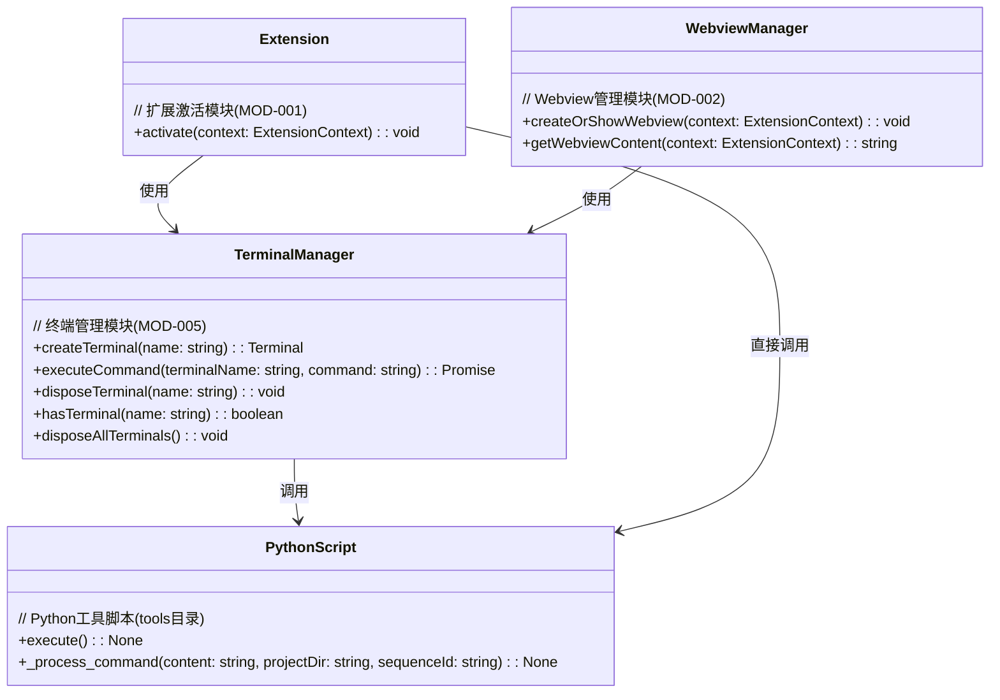

# 终端工具接口设计文档 (MOD-005-INT)

## 1. 接口概述

本文档详细描述了VSCode插件的终端管理模块（TerminalManager，MOD-005）与tools目录下Python脚本之间的通信接口。该接口定义了命令传递、执行和结果返回的标准格式，确保插件与外部工具之间的可靠交互。

## 2. 接口架构

### 2.1 整体架构

终端管理模块与Python工具脚本的交互采用命令行参数传递和标准输出捕获的方式。具体架构如下：

```
┌─────────────────┐     命令行参数(JSON)     ┌─────────────────────┐
│                 │────────────────────────▶│                     │
│ TerminalManager │                         │ Python脚本(tools目录) │
│                 │◀────────────────────────│                     │
└─────────────────┘      标准输出(JSON)       └─────────────────────┘
```

### 2.2 模块间接口关系图



### 2.3 接口范围

本接口规范适用于以下组件间的通信：
- 终端管理模块 (MOD-005) 与 Python 工具脚本 (tools目录) 主程序（interactive_tool.py/interactive-tools.py）和第二程序 execinfo.py  
- 终端管理模块 (MOD-005) 与 集成终端窗口（第三命令） 通信,  接受第三命令的返回信息
- Webview管理模块 (MOD-002) 通过终端管理模块与 Python 工具脚本通信 主程序（interactive_tool.py/interactive-tools.py）和第二程序 execinfo.py  以及和集成终端窗口第三命令通讯。 

## 3. Webview-终端-工具交互接口说明

本节详细描述HTML界面、终端和工具之间的交互接口定义，包括5个核心接口。

### 3.1 接口1：Webview-终端（主命令）

**功能**：Webview界面向终端发送主命令，触发工具执行。

**交互流程**：
1. Webview界面收集用户输入的命令信息
2. 将命令信息封装为JSON格式
3. 通过VSCode API发送至终端管理模块
4. 终端管理模块创建或选择对应的终端执行命令

**数据格式**：
```json
{
  "type": "main_command",
  "command": "user_input_command",
  "sequenceId": "unique-id",
  "context": {}
}
```

**字段说明**：
| 字段名 | 类型 | 必填 | 描述 |
|--------|------|------|------|
| type | string | 是 | 固定值"main_command"，标识主命令类型 |
| command | string | 是 | 用户输入的命令内容 |
| sequenceId | string | 是 | 命令唯一标识符 |
| context | object | 否 | 命令执行上下文信息 |

### 3.2 接口2：终端与工具主命令

**功能**：终端管理模块向Python工具脚本传递主命令。

**交互流程**：
1. 终端管理模块接收HTML界面的命令请求
2. 构造标准的JSON命令参数
3. 通过命令行调用Python工具脚本

**数据格式**：
```json
{
  "content": "command_to_execute",
  "projectDir": "/path/to/project",
  "sequenceId": "unique-id",
  "osType": "windows"
}
```

**字段说明**：
| 字段名 | 类型 | 必填 | 描述 |
|--------|------|------|------|
| content | string | 是 | 要执行的命令内容 |
| projectDir | string | 否 | 执行命令的工作目录，默认为当前目录 |
| sequenceId | string | 否 | 命令的唯一标识符，用于跟踪命令执行 |
| osType | string | 否 | 操作系统类型，可能的值：windows、linux、darwin(macOS)，默认为当前系统类型 |

### 3.3 接口3：Webview-终端（第三命令）

**功能**：Webview界面中命令行代码后面的按钮，触发特定命令下发给终端窗口执行。

**交互流程**：
1. 用户在Webview界面点击代码块旁的执行按钮
2. Webview捕获点击事件，提取相关代码和元数据
3. 构造第三命令并通过VSCode API发送至终端管理模块
4. 终端管理模块将命令输入到指定的集成终端窗口

**数据格式**：
```json
{
  "type": "third_command",
  "codeId": "code-block-unique-id",
  "codeContent": "code_to_execute",
  "codeLanguage": "python",
  "sequenceId": "unique-id"
}
```

**字段说明**：
| 字段名 | 类型 | 必填 | 描述 |
|--------|------|------|------|
| type | string | 是 | 固定值"third_command"，标识第三命令类型 |
| codeId | string | 是 | 代码块的唯一标识符 |
| codeContent | string | 是 | 要在终端中执行的代码内容 |
| codeLanguage | string | 是 | 代码的编程语言类型 |
| sequenceId | string | 是 | 命令唯一标识符 |

### 3.4 接口4：终端-工具（第二命令：execinfo.py）

**功能**：将集成终端回显收集回来传递给execinfo.py工具，并执行后将结果返回终端。

**交互流程**：
1. 终端管理模块捕获集成终端的输出内容
2. 提取需要处理的命令执行结果
3. 调用execinfo.py工具进行处理
4. 接收execinfo.py工具的处理结果
5. 将处理结果发送回集成终端显示

**数据格式**（终端到工具）：
```json
{
  "type": "second_command",
  "sourceOutput": "terminal_output_content",
  "codeContent": "code_to_execute",
  "codeId": "code-block-unique-id",
  "codeLanguage": "python",
  "projectDir": "/path/to/project",
  "sequenceId": "unique-id"
}
```

**字段说明**：
| 字段名 | 类型 | 必填 | 描述 |
|--------|------|------|------|
| type | string | 是 | 固定值"second_command"，标识第二命令类型 |
| sourceOutput | string | 是 | 从集成终端收集的输出内容 |
| codeContent | string | 是 | 执行的代码内容 |
| codeId | string | 是 | 代码块的唯一标识符 |
| codeLanguage | string | 是 | 代码的编程语言类型 |
| projectDir | string | 否 | 项目目录路径 |
| sequenceId | string | 是 | 命令唯一标识符 |

### 3.5 接口5：终端-Webview（第二命令结果展示）

**功能**：将第二命令执行的结果返回给Webview界面进行展示。

**交互流程**：
1. 终端管理模块接收工具处理的结果
2. 格式化结果数据为Webview可展示的格式
3. 通过VSCode API向Webview界面发送结果数据
4. Webview界面接收并渲染结果内容

**数据格式**：
```json
{
  "type": "second_command_result",
  "result": {
    "type": "processed_output_type",
    "content": "processed_content",
    "metadata": {}
  },
  "sequenceId": "unique-id",
  "timestamp": "2023-10-09T12:34:56Z"
}
```

**字段说明**：
| 字段名 | 类型 | 必填 | 描述 |
|--------|------|------|------|
| type | string | 是 | 固定值"second_command_result"，标识第二命令结果类型 |
| result | object | 是 | 处理后的结果数据 |
| result.type | string | 是 | 结果类型（text, table, image, code等） |
| result.content | string/object | 是 | 结果内容 |
| result.metadata | object | 否 | 结果相关的元数据 |
| sequenceId | string | 是 | 与请求对应的唯一标识符 |
| timestamp | string | 是 | 结果生成时间戳 |

### 3.6 接口6：主命令/第二命令到终端消息

**功能**：主命令(interactive-tool.py/interactive-tools.py)和第二命令(execinfo)的执行结果以标准输出消息格式返回给终端。

**交互流程**：
1. 工具脚本（interactive-tool.py/interactive-tools.py或execinfo）执行完成后生成结果
2. 将结果封装为标准的输出消息格式
3. 通过标准输出返回给终端管理模块
4. 终端管理模块接收并处理这些消息

**数据格式**：
```json
[
  {
    "type": "text",
    "content": "执行结果文本",
    "isError": false,
    "isEnd": false,
    "sequenceId": "unique-id",
    "commandType": "main_command"  // 或 "second_command"
  },
  {
    "type": "end",
    "content": "",
    "isError": false,
    "isEnd": true,
    "sequenceId": "unique-id",
    "commandType": "main_command"  // 或 "second_command"
  }
]
```

**字段说明**：
| 字段名 | 类型 | 必填 | 描述 |
|--------|------|------|------|
| type | string | 是 | 输出类型（text, error, command, python, table, image等） |
| content | string | 是 | 输出内容 |
| isError | boolean | 是 | 是否为错误信息 |
| isEnd | boolean | 是 | 是否为命令执行结束标记 |
| sequenceId | string | 是 | 与请求对应的唯一标识符 |
| commandType | string | 是 | 命令类型，值为"main_command"（主命令）或"second_command"（第二命令） |

## 4. 输入接口定义

### 4.1 总体格式

终端管理模块向Python脚本传递的输入为JSON格式字符串，作为命令行参数。

```json
{
  "content": "command_to_execute",
  "projectDir": "/path/to/project",
  "sequenceId": "unique-id",
  "osType": "windows" // 操作系统类型：windows, linux, darwin(macOS)
}
```

### 3.2 字段说明

| 字段名 | 类型 | 必填 | 描述 |
|--------|------|------|------|
| content | string | 是 | 要执行的命令内容 |
| projectDir | string | 否 | 执行命令的工作目录，默认为当前目录 |
| sequenceId | string | 否 | 命令的唯一标识符，用于跟踪命令执行 |
| osType | string | 否 | 操作系统类型，可能的值：windows、linux、darwin(macOS)，默认为当前系统类型 |

### 3.3 特殊情况处理

Python脚本需要处理以下特殊情况的输入格式：

1. **转义字符处理**：处理包含转义字符的JSON字符串
2. **PowerShell格式**：处理PowerShell可能传递的特殊格式（如缺少引号的JSON：`{content:dir,projectDir:}`）

## 4. 输出接口定义

### 4.1 总体格式

Python脚本通过标准输出返回JSON数组，每个元素表示一条输出信息。以下是包含多种输出类型的完整示例：

```json
[
  {
    "type": "text",
    "content": "开始执行命令...",
    "isError": false,
    "isEnd": false,
    "sequenceId": "unique-id-123",
    "commandType": "main_command"  // 或 "second_command"
  },
  {
    "type": "progress",
    "content": "{\"current\": 25, \"total\": 100, \"status\": \"正在准备数据\"}",
    "isError": false,
    "isEnd": false,
    "sequenceId": "unique-id-123",
    "commandType": "main_command"  // 或 "second_command"
  },
  {
    "type": "table",
    "content": "{\"header\": [\"文件名\", \"大小\", \"修改时间\"], \"rows\": [[\"file1.txt\", \"1024B\", \"2023-10-09\"], [\"file2.txt\", \"2048B\", \"2023-10-08\"]]}",
    "isError": false,
    "isEnd": false,
    "sequenceId": "unique-id-123",
    "commandType": "main_command"  // 或 "second_command"
  },
  {
    "type": "command",
    "content": "ls -la",
    "isError": false,
    "isEnd": false,
    "sequenceId": "unique-id-123",
    "commandType": "main_command"  // 或 "second_command"
  },
  {
    "type": "python",
    "content": "print('Hello from Python!')",
    "isError": false,
    "isEnd": false,
    "sequenceId": "unique-id-123",
    "commandType": "main_command"  // 或 "second_command"
  },
  {
    "type": "image",
    "content": "{\"type\": \"png\", \"data\": \"iVBORw0KGgoAAAANSUhEUgAAAAEAAAABCAYAAAAfFcSJAAAADUlEQVR42mNkYPhfDwAChwGA60e6kgAAAABJRU5ErkJggg==\", \"alt\": \"示例图片\"}",
    "isError": false,
    "isEnd": false,
    "sequenceId": "unique-id-123",
    "commandType": "main_command"  // 或 "second_command"
  },
  {
    "type": "link",
    "content": "{\"url\": \"https://example.com\", \"text\": \"查看详细文档\"}",
    "isError": false,
    "isEnd": false,
    "sequenceId": "unique-id-123",
    "commandType": "main_command"  // 或 "second_command"
  },
  {
    "type": "error",
    "content": "警告：部分数据可能已过期",
    "isError": true,
    "isEnd": false,
    "sequenceId": "unique-id-123",
    "commandType": "main_command"  // 或 "second_command"
  },
  {
    "type": "text",
    "content": "命令执行完成",
    "isError": false,
    "isEnd": false,
    "sequenceId": "unique-id-123",
    "commandType": "main_command"  // 或 "second_command"
  },
  {
    "type": "end",
    "content": "",
    "isError": false,
    "isEnd": true,
    "sequenceId": "unique-id-123",
    "commandType": "main_command"  // 或 "second_command"
  }
]
```

### 4.2 输出元素字段说明

| 字段名 | 类型 | 描述 |
|--------|------|------|
| type | string | 输出类型（text, error, command, python, javascript, typescript, html, css, json, table, image, link, progress, end等） |
| content | string | 输出内容。对于简单类型（如text、error、command等），直接包含文本内容；对于复杂类型（如table、image、link、progress等），包含JSON字符串格式的数据 |
| isError | boolean | 是否为错误信息，设置为true时通常对应type="error"的输出 |
| isEnd | boolean | 是否为命令执行结束标记，仅在type="end"时设置为true |
| sequenceId | string | 与输入相同的序列号，用于跟踪命令执行的完整生命周期 |
| commandType | string | 命令类型，值为"main_command"（主命令）或"second_command"（第二命令），用于标识当前输出消息对应的命令类型 |

### 4.3 支持的输出类型

| 类型 | 描述 | 示例内容 |
|------|------|----------|
| text | 普通文本输出 | "执行成功" |
| error | 错误信息 | "命令执行失败：文件不存在" |
| command | 命令行代码 | "ls -la" |
| python | Python代码 | "print('Hello World')" |
| javascript | JavaScript代码 | "console.log('Hello World');" |
| typescript | TypeScript代码 | "const message: string = 'Hello World';" |
| html | HTML代码 | "<div class='container'>Hello World</div>" |
| css | CSS代码 | ".container { color: blue; }" |
| json | JSON数据 | "{\"name\": \"test\", \"value\": 123}" |
| table | 表格数据 | JSON格式的表格数据（见4.4节详细说明） |
| image | 图片数据 | Base64编码的图片数据（见4.5节详细说明） |
| link | 链接信息 | JSON格式的链接数据（见4.6节详细说明） |
| progress | 进度信息 | JSON格式的进度数据（见4.7节详细说明） |
| end | 命令结束标记 | "" |

### 4.4 表格数据格式

表格数据采用嵌套JSON结构，包含表头和行数据：

```json
{
  "header": ["列1", "列2", "列3"],
  "rows": [
    ["值1-1", "值1-2", "值1-3"],
    ["值2-1", "值2-2", "值2-3"]
  ],
  "metadata": {
    "title": "表格标题",
    "alignments": ["left", "center", "right"],
    "styles": {
      "header": {"background": "#f0f0f0"},
      "rows": {"even": {"background": "#ffffff"}, "odd": {"background": "#f9f9f9"}}
    }
  }
}
```

### 4.5 图片数据格式

图片数据采用Base64编码格式，包含图片类型和数据：

```json
{
  "type": "png",  // 支持png, jpeg, gif, svg等
  "data": "iVBORw0KGgoAAAANSUhEUgAAAAEAAAABCAYAAAAfFcSJAAAADUlEQVR42mNkYPhfDwAChwGA60e6kgAAAABJRU5ErkJggg==",
  "width": 200,   // 可选，宽度
  "height": 150,  // 可选，高度
  "alt": "图片描述" // 可选，替代文本
}
```

### 4.6 链接信息格式

链接信息包含URL和显示文本：

```json
{
  "url": "https://example.com",
  "text": "示例链接",
  "tooltip": "悬停提示文本", // 可选
  "target": "_blank" // 可选，打开方式
}
```

### 4.7 进度信息格式

进度信息包含当前进度和状态描述：

```json
{
  "current": 50,     // 当前进度值（0-100）
  "total": 100,      // 总量（可选）
  "status": "处理中...", // 当前状态描述
  "detail": "正在处理第3项任务" // 详细信息（可选）
}

## 5. Python工具脚本说明

### 5.1 主命令脚本：interactive-tool.py

**功能**：主命令脚本，负责接收命令并执行，支持多种命令类型和输出格式。

**使用方式**：
```bash
python interactive-tool.py "{\"content\": \"command params\", \"projectDir\": \"/path/to/project\", \"sequenceId\": \"unique-id\"}"
```

**支持的命令**：
- help：显示帮助信息
- run：运行示例交互式命令
- info：显示特定主题的信息
- generate：生成指定类型的示例代码

### 5.2 第二命令脚本：execinfo.py

**功能**：专注于执行命令行代码并捕获输出，提供更丰富的执行信息。

**使用方式**：
```bash
python execinfo.py "{\"content\": \"command_to_execute\", \"projectDir\": \"/path/to/project\", \"sequenceId\": \"unique-id\"}"
```

### 5.3 测试脚本：test_json.py

**功能**：测试JSON解析逻辑，确保脚本能正确处理各种格式的JSON输入。

## 6. 终端管理模块调用示例

以下是终端管理模块调用Python脚本的示例代码，包括对新增复杂输出类型的处理：

```typescript
import * as vscode from 'vscode';
import { exec } from 'child_process';
import { Logger } from './logger';

/**
 * 处理Python脚本返回的不同类型输出
 * @param outputItem 单个输出项
 * @returns 处理后的输出项
 */
function processOutputItem(outputItem: any): any {
  // 深拷贝输出项以避免修改原始数据
  const processedItem = { ...outputItem };
  
  // 对于复杂输出类型，尝试解析content字段中的JSON
  const complexTypes = ['table', 'image', 'link', 'progress'];
  
  if (complexTypes.includes(processedItem.type)) {
    try {
      // 尝试解析content字段中的JSON
      processedItem.content = JSON.parse(processedItem.content);
    } catch (parseError) {
      Logger.warn(`Failed to parse content for ${processedItem.type} output: ${parseError.message}`);
      // 解析失败时保持原始内容
    }
  }
  
  return processedItem;
}

/**
 * 执行Python脚本并返回结果
 * @param scriptPath Python脚本路径
 * @param content 命令内容
 * @param projectDir 项目目录
 * @returns Promise<any> 执行结果
 */
export async function executePythonScript(scriptPath: string, content: string, projectDir: string = process.cwd()): Promise<any> {
  // 生成唯一的序列号
  const sequenceId = Date.now().toString();
  
  // 获取当前操作系统类型
  const osType = process.platform === 'win32' ? 'windows' : process.platform;
  
  // 构造JSON输入
  const inputData = JSON.stringify({
    content: content,
    projectDir: projectDir,
    sequenceId: sequenceId,
    osType: osType
  });
  
  // 构造命令行参数
  const command = `python "${scriptPath}" "${inputData}"`;
  
  Logger.debug(`Executing Python script: ${command}`);
  
  // 执行命令并返回Promise
  return new Promise((resolve, reject) => {
    exec(command, (error, stdout, stderr) => {
      if (error) {
        Logger.error(`Error executing Python script: ${error.message}`);
        reject(error);
        return;
      }
      
      if (stderr) {
        Logger.warn(`Python script stderr: ${stderr}`);
      }
      
      try {
        // 解析JSON输出
        const output = JSON.parse(stdout);
        
        // 处理输出结果
        if (Array.isArray(output)) {
          // 对数组中的每个输出项进行处理
          const processedOutput = output.map(processOutputItem);
          resolve(processedOutput);
        } else if (typeof output === 'object') {
          // 对单个输出项进行处理
          resolve(processOutputItem(output));
        } else {
          // 对于非对象类型的输出，包装为文本类型
          resolve({
            type: 'text',
            content: String(output),
            isError: false,
            isEnd: true,
            sequenceId: sequenceId
          });
        }
      } catch (parseError) {
        Logger.error(`Failed to parse Python script output: ${parseError.message}`);
        // 返回原始输出作为后备
        resolve([{
          type: 'text',
          content: stdout,
          isError: false,
          isEnd: true,
          sequenceId: sequenceId
        }]);
      }
    });
  });
}
```

## 7. 错误处理机制

### 7.1 输入错误
- JSON解析失败：尝试修复常见的格式问题，如处理转义字符、处理PowerShell特殊格式
- 参数缺失：使用默认值替代缺失的可选参数

### 7.2 执行错误
- 命令执行失败：返回包含错误信息的JSON对象，`isError`字段设为`true`
- 脚本运行异常：捕获异常并返回标准错误格式

### 7.3 输出解析错误
- 输出不是有效的JSON：返回原始输出内容作为文本

## 8. 千问大模型集成处理

### 8.1 集成架构概述

为支持与千问大模型的集成，终端工具接口需要进行扩展，以实现命令的接收、大模型处理、工具调用和结果返回的完整流程。以下是集成后的架构示意图：

```
┌─────────────┐     命令输入(JSON)     ┌─────────────────────┐     API调用     ┌─────────────┐
│             │─────────────────────▶│                     │───────────────▶│             │
│  VSCode界面  │                     │  终端管理模块(MOD-005) │                 │ 千问大模型   │
│             │◀─────────────────────│                     │◀───────────────│             │
└─────────────┘     结果输出(JSON)     └─────────────────────┘     工具回调     └─────────────┘
                         │                                            │
                         ▼                                            ▼
                  ┌─────────────┐                              ┌─────────────┐
                  │  Python工具脚本 │                              │ 扩展工具注册  │
                  └─────────────┘                              └─────────────┘
```

### 8.2 处理流程

1. **命令接收与解析**
   - 终端管理模块接收来自VSCode界面的命令输入（遵循第3节定义的JSON格式）
   - 提取`content`字段作为需要大模型处理的主要内容

2. **千问大模型连接与处理**
   ```typescript
   import { QianwenClient } from './qianwenClient';
   
   async function processWithQianwenModel(content: string, sequenceId: string): Promise<any> {
     const client = new QianwenClient();
     
     // 注册扩展工具给大模型
     const tools = registerExtensionTools(sequenceId);
     
     // 发送内容给大模型处理
     const response = await client.sendRequest({
       content: content,
       tools: tools,
       sequenceId: sequenceId
     });
     
     return response;
   }
   ```

3. **扩展工具注册**
   - 将终端工具接口支持的输出类型注册为千问大模型的扩展工具
   - 为每种输出类型定义对应的工具调用模式和参数规范
   ```typescript
   function registerExtensionTools(sequenceId: string): Array<any> {
     return [
       {
         name: "output_text",
         description: "输出文本信息给用户",
         parameters: {
           type: "object",
           properties: {
             content: { type: "string", description: "文本内容" },
             isError: { type: "boolean", description: "是否为错误信息", default: false }
           },
           required: ["content"]
         }
       },
       {
         name: "output_table",
         description: "输出表格数据给用户",
         parameters: {
           type: "object",
           properties: {
             header: { type: "array", items: { type: "string" }, description: "表头" },
             rows: { type: "array", items: { type: "array" }, description: "行数据" },
             metadata: { type: "object", description: "表格元数据", required: false }
           },
           required: ["header", "rows"]
         }
       },
       // 其他工具类型注册...
       {
         name: "end_execution",
         description: "结束当前执行流程",
         parameters: { type: "object", properties: {} }
       }
     ];
   }
   ```

4. **工具回调处理**
   - 接收大模型的工具调用请求
   - 根据调用的工具类型，格式化输出并通过终端管理模块展示给用户
   ```typescript
   async function handleToolCall(toolCall: any, sequenceId: string): Promise<any> {
     const { name, parameters } = toolCall;
     
     switch (name) {
       case "output_text":
         return await outputManager.showText(parameters.content, parameters.isError, sequenceId);
       case "output_table":
         return await outputManager.showTable(parameters.header, parameters.rows, parameters.metadata, sequenceId);
       // 处理其他工具调用...
       case "end_execution":
         return await outputManager.endExecution(sequenceId);
       default:
         throw new Error(`Unknown tool: ${name}`);
     }
   }
   ```

5. **用户交互处理**
   - 支持大模型发起的用户交互请求
   - 实现异步等待机制，直到用户提供输入后继续处理
   ```typescript
   async function requestUserInput(prompt: string, sequenceId: string): Promise<string> {
     return new Promise((resolve) => {
       // 注册输入处理器，等待用户响应
       inputManager.registerInputHandler(sequenceId, resolve);
       // 显示提示信息给用户
       outputManager.showText(prompt, false, sequenceId);
     });
   }
   ```

### 8.3 架构选择评估

对于需要实时多次交互的场景，**RESTful API架构相比命令行工具架构具有明显优势**，主要体现在以下几个方面：

1. **长连接支持**
   - RESTful API可以基于WebSocket等协议实现长连接，保持会话状态
   - 命令行工具每次调用都需要创建新进程，无法高效维护会话

2. **实时交互性能**
   - RESTful API可以实现低延迟的双向通信，适合频繁交互场景
   - 命令行工具的进程创建和销毁开销较大，不适合高频率交互

3. **会话状态管理**
   - RESTful API可以在服务端维护会话状态，支持上下文保持
   - 命令行工具是无状态的，每次调用都需要重新传递完整上下文

4. **扩展性**
   - RESTful API易于扩展新功能和支持更多客户端类型
   - 命令行工具的扩展受到命令行参数和标准I/O的限制

5. **错误处理**
   - RESTful API可以利用HTTP状态码和结构化错误信息进行精确的错误处理
   - 命令行工具的错误处理依赖于退出码和标准错误输出，表达能力有限

**建议架构升级方案**：

1. 将现有的Python脚本转换为RESTful API服务
2. 使用WebSocket支持实时双向通信
3. 实现会话管理机制，保持上下文状态
4. 定义明确的API端点和数据格式

```typescript
// RESTful API服务调用示例
async function callQianwenIntegrationService(content: string, projectDir: string, sequenceId: string): Promise<any> {
  const response = await fetch('http://localhost:3000/api/qianwen/integrate', {
    method: 'POST',
    headers: {
      'Content-Type': 'application/json',
    },
    body: JSON.stringify({
      content: content,
      projectDir: projectDir,
      sequenceId: sequenceId,
      osType: process.platform === 'win32' ? 'windows' : process.platform
    })
  });
  
  return await response.json();
}
```

## 9. 性能优化建议

1. **避免重复创建进程**：对于频繁调用的脚本，考虑使用进程池或长连接
2. **异步执行**：确保脚本执行不会阻塞主线程
3. **超时处理**：为脚本执行设置合理的超时时间
4. **输出流处理**：对于长时间运行的命令，考虑使用流处理实时获取输出
5. **会话复用**：在大模型集成场景中，复用会话连接以提高性能

## 10. 版本控制

| 版本 | 日期 | 修改内容 | 作者 |
|------|------|----------|------|
| 1.7 | 2025-10-16 | 将HTML-终端交互中的HTML修改为Webview，在主程序后增加interactive-tools.py | VSCode插件开发团队 |
| 1.6 | 2025-10-15 | 添加接口6：主命令/第二命令到终端消息，更新输出接口定义，在4.1总体格式中增加commandType字段标识主命令或第二命令 | VSCode插件开发团队 |
| 1.5 | 2025-10-14 | 更新接口定义：移除接口1和3的targetTerminal字段，接口3增加codeLanguage字段，接口4移除originalCommand字段并增加codeContent、codeId和codeLanguage字段 | VSCode插件开发团队 |
| 1.4 | 2025-10-13 | 添加HTML-终端-工具交互接口说明，包括HTML-终端主命令、终端与工具主命令、HTML-终端第三命令(代码块按钮触发)、终端-工具第二命令(execinfo.py)和终端-HTML第二命令结果展示五个接口的详细定义 | VSCode插件开发团队 |
| 1.3 | 2025-10-12 | 添加千问大模型集成处理部分，包括集成架构、处理流程、工具注册、回调处理和用户交互机制，并评估了RESTful API架构在实时交互场景中的优势 | VSCode插件开发团队 |
| 1.2 | 2025-10-11 | 在输入接口中增加osType字段，支持传递当前操作系统类型信息 | VSCode插件开发团队 |
| 1.1 | 2025-10-10 | 扩展输出接口，支持文本、图片、表格、命令行代码、多种编程语言代码等多种输出类型 | VSCode插件开发团队 |
| 1.0 | 2025-10-09 | 初始版本 | VSCode插件开发团队 |